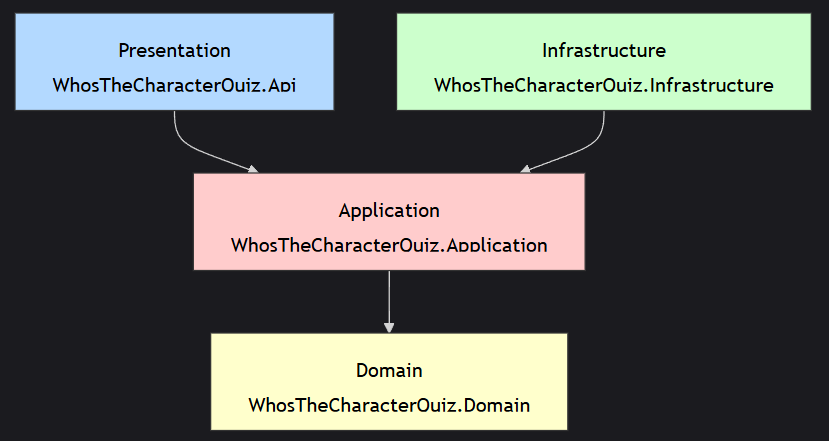

# "Who's The Character" Quiz

## Purpose
The thought behind this project is to generate Quizzes about Rick and Morty, where each question displays
the image of a character and 4 options with the possible names matching the image.

## Architecture
The project is divided according to the toughts in Clean architecture along with Domain Driven Design. 

The entry point of the project is WhosTheCharacterQuiz.Api, a WebApi project.
In the Requests folder you can find a CreateQuiz.http file, where, when running the project locally, can invoke the create quiz endpoint.

When this is invoked, the Rick and Marty API is invoked, using GraphQL, with a simple query retrieving all the characters, but only a subset of properties.
The generator picks randomly distinct characters and generates a quiz, which is returned to the client.
In the current implementation, the quiz creation returns the correct answer.
The quizzes generated are saved in memory, which means that once the project is restarted the data is lost.

The domain models can be found in the WhosTheCharacterQuiz.Domain. 
They cover both the quiz creation and a player playing the quiz.

## Implementation details
- I used Mediatr and CQRS because I wanted to try it out on a greenfield project. This supports pipeline behaviors, so adding validation to it at the application level was easy.
- Mapster has been used for auto-mapping data transfer objects to models.
- StraweberryShake has been used to generate the GraphQL client for Rick and Morty API.
- ErrorOr has been used for error handling, since it allows returning either the desired result, but also one or multiple errors.

## Further development directions
- Make the quizzes persistent, spin a container for the database
- Implement the logic for playing the game
- Add an UI to be able to take a quiz
- Enhance the quiz generation - difficulty levels, adaptive, more advanced queries to retrieve the data, 
cache the retrieval of the characters.
- Add logging
- Add unit tests

